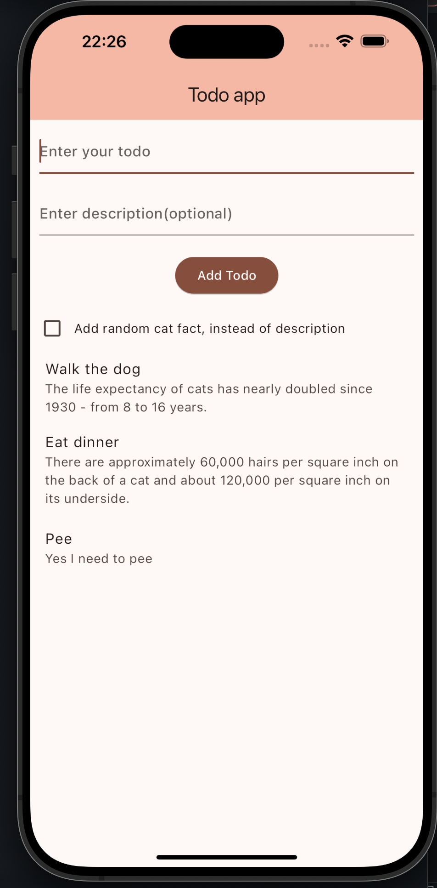

# Flutter TODO App

A simple Flutter application for managing a list of TODOs. Each TODO can have a title, a description fetched from a random cat fact API.

## Features

- Add a TODO with a title and a optional random description.
- Display a list of TODOs.
- Remove TODOs from the list by tapping.

## Getting Started

### Prerequisites

- Flutter SDK: [Install Flutter](https://flutter.dev/docs/get-started/install)
- A code editor like VS Code, Android Studio, or IntelliJ.

### Installation

1. Clone the repository:

    ```bash
    git clone https://github.com/your-username/flutter-todo-app.git
    cd flutter-todo-app
    ```

2. Install dependencies:

    ```bash
    flutter pub get
    ```

3. Run the app:

    ```bash
    flutter run
    ```

## Usage

- **Add a TODO**
  - Enter a title in the text field.
  - Click the "Add Todo" button to add a new TODO.
  - The description is fetched automatically from a random cat fact API.

- **Remove a TODO**
  - Tap on a TODO item to remove it from the list.

## Screenshots




## Dependencies

- [http](https://pub.dev/packages/http): ^0.13.3

## Contributing

Feel free to submit issues and enhancement requests.

## License

This project is licensed under the MIT License - see the [LICENSE.md](LICENSE.md) file for details.

## Author
- Andreas Nilsson an224qi@student.lnu.se
